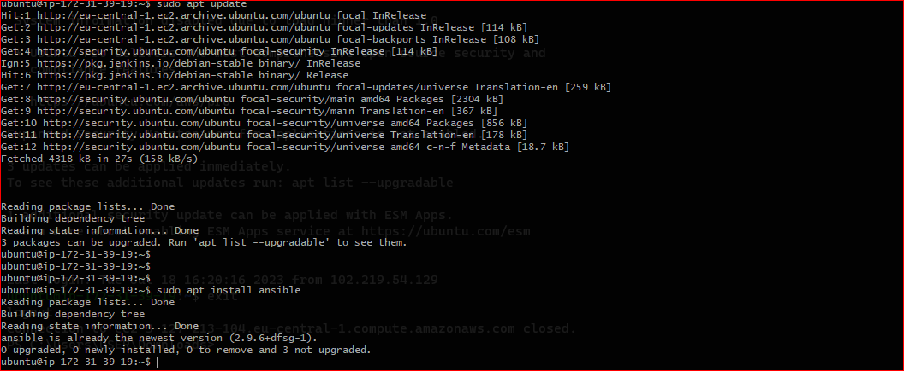
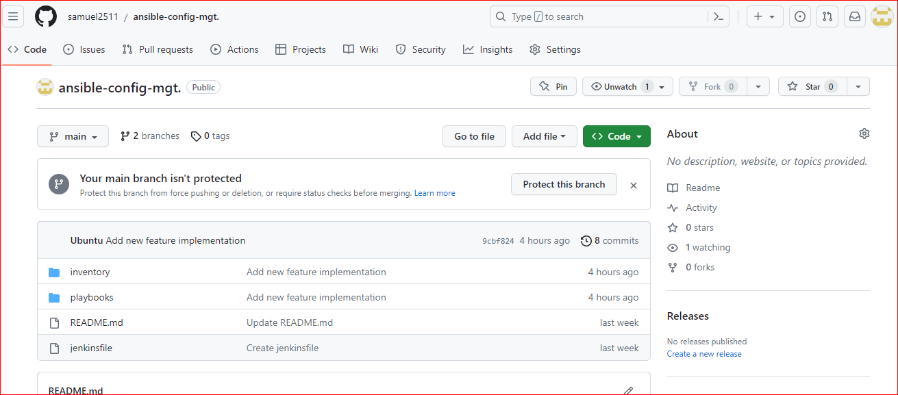
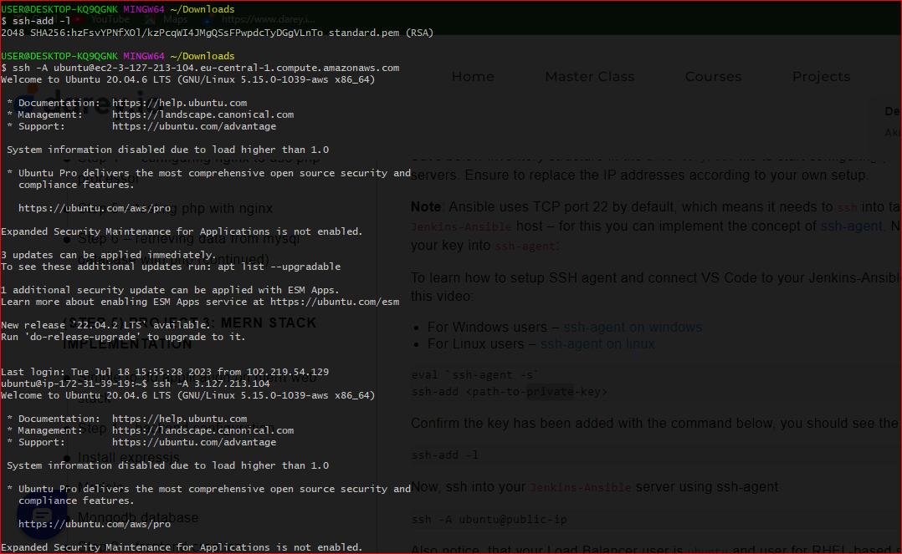
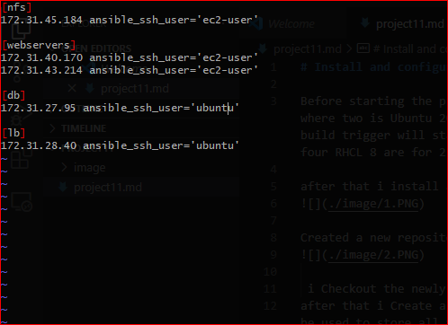
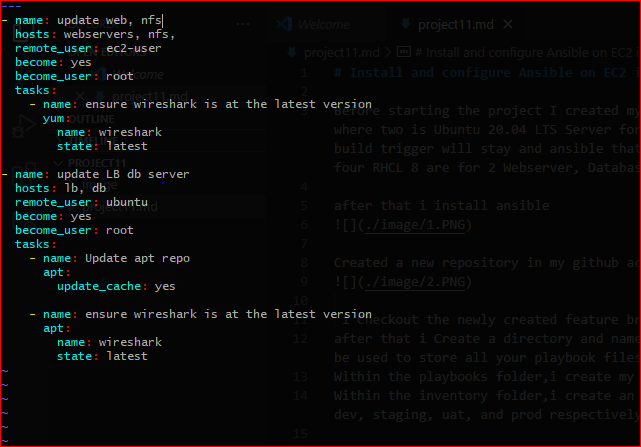
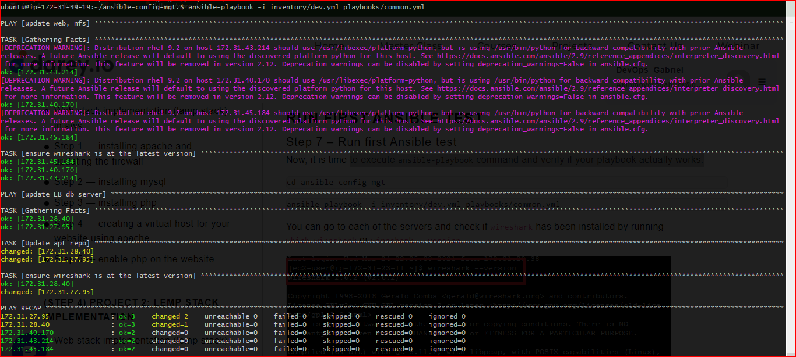

# Install and configure Ansible on EC2 instance

Before starting the project I created my set up with tilix to easily navigate between the servers then created six virtual server where two is Ubuntu 20.04 LTS Server for the Load Balancer Server and Ansible-Jenkins Server where Jenkins for creating a webhook build trigger will stay and ansible that I will use SSH-Agent to connect to the other servers and test the ansible play. The other four RHCL 8 are for 2 Webserver, Database Server and NFS Server.

after that i install ansible 

Created a new repository in my github account then add webhook.

 
 i Checkout the newly created feature branch to my local machine and start building your code and directory structure
after that i Create a directory and name it INVENTORY-that i will be used to keep your hosts organised. and PLAYBOOKS-that i will be used to store all your playbook files.
Within the playbooks folder,i create my first playbook, and name it common.yml
Within the inventory folder,i create an inventory file (.yml) for each environment (Development, Staging Testing and Production) dev, staging, uat, and prod respectively.

then i Set up an Ansible Inventory and ensure that it is the intended configuration on a particular server that occurs. It is important to have a way to organize our hosts in such an Inventory.

then i update my inventory/dev.yml file with this snippet of code

after done with my inventory/dev.yml i Update playbooks/common.yml

then i commit and push to my GitHub branch, and cd back to ansible-config-mgt server,and i verify if playbook actually works

